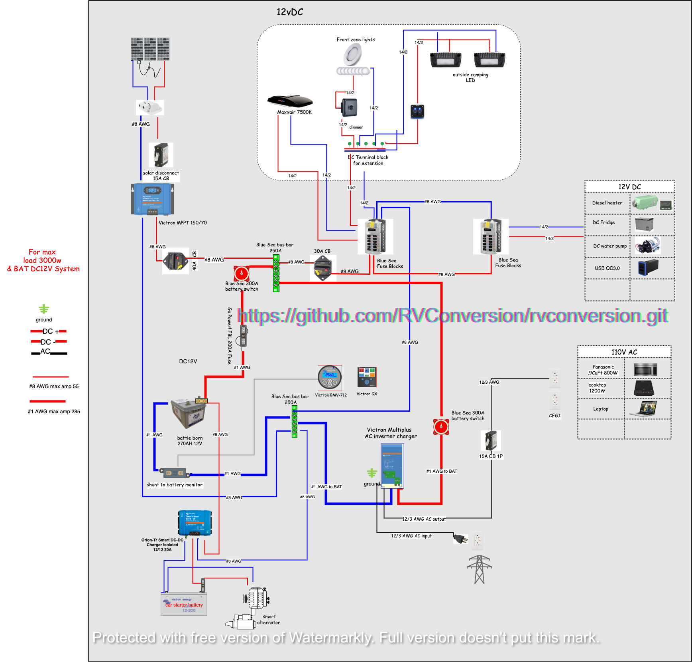

# RV conversion 知识分享红宝书

# 电路系统

## 12v/24v系统

### 太阳能

#### 太阳能充电器

### 电池
LiFePO4电池很安全。所有的战机电池都使用最安全，最稳定的组件，包括LiFePO4阴极和内置的电池管理系统（BMS）。
BMS保护电池免受过高或过低的电压，高电流，短路以及过热或过冷的影响。
锂离子电池比铅酸电池更安全，铅酸电池没有针对接地故障的保护措施。内置BMS可以防止接地故障。
LiFePO4电池能够运行3,000次循环，大多数人将使用这些电池10到15年。

如果没有足够的信息来进行正确的计算，那么为离网或移动电源系统调整电池组的尺寸可能会变得很复杂。  
您将需要一些基本信息才能上手。 您将需要要供电的设备的最大持续消耗功率（以安培或瓦为单位。  
这些通常位于设备上某个地方的贴纸或板上，显示该设备的安培和伏特或功率（瓦）。  
举例来说，你的系统需要在120伏的电压下运行10安培，持续3.5小时。 10安培x 120伏特= 1200瓦特的功率。  
1200瓦x 3.5小时= 4200瓦时。  
接下来，您需要将4200瓦时转换为直流（DC）安时。对于示例，将使用12伏电池组。  
4200瓦时/ 12伏= 350 DC安培小时的电池能量，适用于我们的示例应用。  
同样，电池需要能够提供1200瓦/ 12伏= 100安的功率。  
 我们将使用100安培小时的电池来构建该系统。 350安培小时/ 100安培小时= 3.5 将需要使用四个100安培小时的LiFePO4战斗用电池为该系统供电。

## 110V 电路系统

## 12v/24v 110v 转换系统

# 水路系统

# 车身保温

# 新风系统

## 冷

## 热

# 内部装修

## 龙骨

## 地板

# 外部装修
